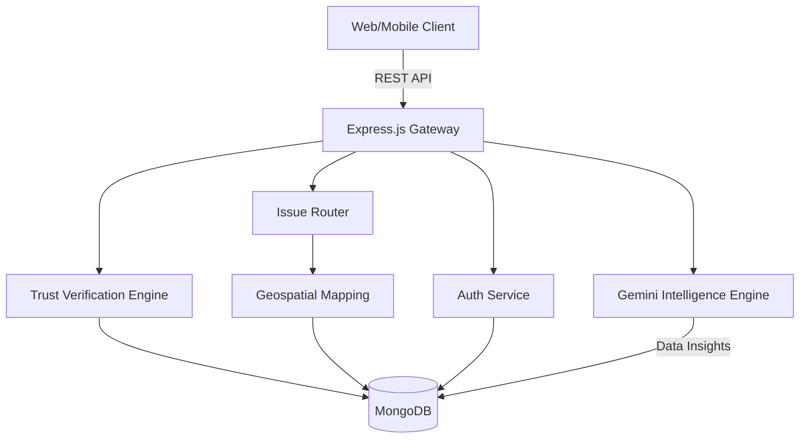

# CivicEye AI 👁️🏙️

**The AI-Powered Smart City Digital Twin & Civic Collaboration Platform.**

CivicEye AI is a next-generation civic technology platform designed to bridge the gap between citizens, governments, and NGOs. By leveraging generative AI, geospatial intelligence, and gamified community participation, CivicEye AI transforms reactive complaint management into proactive Smart City governance.

---

## 🚀 Features

### 1. 🤖 AI Civic Digital Twin
- **Live Intelligence Map:** Real-time geospatial tracking of civic issues.
- **Predictive Heatmaps:** AI-generated predictions for disaster risks (e.g., floods, infrastructure failures).
- **Automated Issue Routing:** Gemini AI automatically categorizes, assesses severity, and routes complaints to the exact correct government department within seconds.

### 2. 🛡️ Trust Verification Engine
- **Crowdsourced Validation:** Citizens can upvote and verify active issues.
- **AI Fraud Detection:** The system automatically cross-references uploaded images and descriptions to flag fake or duplicate reports.
- **Dynamic Trust Scores:** Every issue is assigned a 0-100 Trust Score based on community consensus and AI confidence.

### 3. 💬 Civic Copilot (AI Assistant)
- **Context-Aware Assistance:** A floating conversational AI that understands your location and current city health.
- **Instant Guidance:** Ask about nearby NGOs, active emergencies, or volunteer opportunities.

### 4. 🎮 Gamified Citizen Impact
- **Civic Reputation System:** Citizens earn XP and level up by submitting genuine reports or volunteering.
- **Digital Badges:** Unlock achievements for civic duty.

### 5. 🏛️ Unified Ecosystem
- **Government Dashboards:** Officials receive prioritized, deduplicated issue streams with AI-estimated resolution times.
- **NGO & Volunteer Hub:** Verified NGOs can host campaigns, and citizens can seamlessly register to volunteer.

---

## 🛠️ Tech Stack

### Frontend
- **Framework:** Next.js 14 (App Router)
- **Styling:** Tailwind CSS v4, Framer Motion, Glassmorphism UI
- **Maps:** React-Leaflet, Leaflet Heat, React-Leaflet-Cluster
- **Icons & Components:** Lucide React, Shadcn/UI

### Backend
- **Framework:** Node.js, Express, TypeScript
- **Database:** MongoDB (Mongoose), Geospatial Queries (2dsphere)
- **AI Integration:** Google Gemini API
- **Storage:** Cloudinary
- **Security:** Helmet, Express Rate Limit, JWT Authentication

---

## 🏗️ Architecture

---

## 💻 Local Development Setup

### Prerequisites
- Node.js (v18+)
- MongoDB (Local or Atlas)
- Cloudinary Account
- Google Gemini API Key

### 1. Clone the Repository
\`\`\`bash
git clone https://github.com/your-username/civiceye-ai.git
cd civiceye-ai
\`\`\`

### 2. Backend Setup
\`\`\`bash
cd backend
npm install
\`\`\`
Create a `.env` file in the `backend` directory:
\`\`\`env
PORT=5001
MONGO_URI=mongodb://localhost:27017/civiceye
JWT_SECRET=your_super_secret
GEMINI_API_KEY=your_gemini_api_key
CLOUDINARY_CLOUD_NAME=your_cloud_name
CLOUDINARY_API_KEY=your_api_key
CLOUDINARY_API_SECRET=your_api_secret
\`\`\`
Start the backend:
\`\`\`bash
npm run dev
\`\`\`

### 3. Frontend Setup
\`\`\`bash
cd ../frontend
npm install --legacy-peer-deps
\`\`\`
Create a `.env.local` file in the `frontend` directory:
\`\`\`env
NEXT_PUBLIC_API_URL=http://localhost:5001/api
\`\`\`
Start the frontend:
\`\`\`bash
npm run dev
\`\`\`

---

## 🎭 Hackathon Demo Mode

CivicEye AI comes with a built-in one-click demo seeder that populates the entire system with incredibly rich, realistic data perfectly tailored for judging presentations.

**To run the demo seeder:**
\`\`\`bash
cd backend
npx ts-node src/utils/seed_demo.ts
\`\`\`

This will instantly generate:
- Active Infrastructure Emergencies
- AI Trust Scores & Verifications
- Top Citizens with High XP
- Verified NGOs and Active News Alerts

---

## 🐳 Docker Deployment (Production)

To deploy the entire stack using Docker Compose:
\`\`\`bash
docker-compose up --build -d
\`\`\`

---

## 🔮 Future Roadmap
- **IoT Integration:** Connecting live city sensors (air quality, water levels) directly to the Digital Twin.
- **Multilingual Support:** Local language support for broader civic reach.
- **Blockchain Verification:** Immutable records of government funding allocated to resolved issues.

---
*Built with ❤️ for better cities.*
